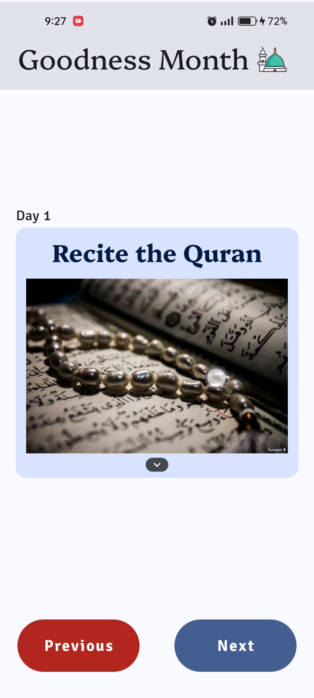

<!-- Title -->

<h1 align="center"><b>Goodness Month</b></h1>

<!-- Social Media Links (Badges) -->

  
  

<!-- Logo -->

  

 

<!-- Description -->

## Description

**Goodness Month** is an islamic app to path through 30 days of goodness
like praying, charity, helping others, ect.

This app has some simple animation with some images to illustrate 
what are charitable works to do over the month.

---

<!-- App Showcase -->

<h2 align="center"> <b>App Preview</b>     </h2>

|  |  |  |  |
|--------------------------------------------|--------------------------------------------|--------------------------------------------|--------------------------------------------|

 

<!-- Installation -->

## Installation

  
<h3>For Users</h3>

  
&nbsp;&nbsp;&nbsp;&nbsp;&nbsp;&nbsp;Download the APK app directly from this link

  &nbsp;&nbsp;&nbsp;&nbsp;&nbsp;&nbsp;&nbsp;&nbsp;&nbsp;
  

  
<h3>For Developers</h3>

  
&nbsp;&nbsp;&nbsp;&nbsp;&nbsp;&nbsp;Download the project using this code in terminal

  <pre><code>git clone https://github.com/Ebrahim-Gamal-77/Goodness-Month.git</code></pre>

